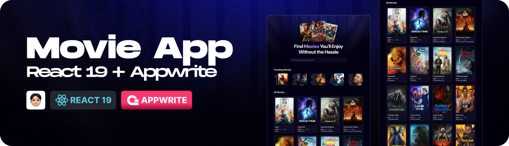

    
   

# 🎬 Movie App (React + Appwrite)

## 🧠 Description

A web application built with **React** and **Appwrite** that integrates **The Movie Database (TMDB) API** to fetch and display movies dynamically.

The app features a **Trending Movies** section based on the most searched titles within the platform. Search data is stored and analyzed using Appwrite to generate internal popularity metrics.

This project combines **external API consumption, modern frontend architecture, and backend data** persistence to create a dynamic movie discovery experience.

---

## 🌐 Live Site

👉 **Live demo:**  
🌐 [Link to Live Demo (Vercel) ↗](react-movie-app-phi-ruby.vercel.app)

---

## 👨‍💻 Author

**Juan Santillán**
| Front-End Developer and creative enthusiast.

---

## 🛠️ Technologies Used

> The following technologies were used in this project.

  
  
  
  

---

## ✨ Notes

- Fetches movie data from TMDB API
- Tracks and stores trending searches using Appwrite
- Built with React and reusable component architecture
- Secure configuration using environment variables
